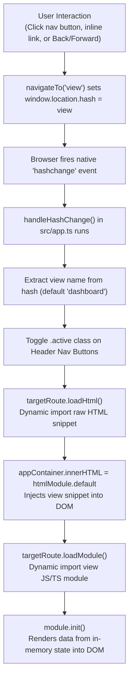

# Exercise 3 — React Foundations & First Migration

## Demo 1 — Historical view of the web

### Tasks

#### 1. Concise explanation of how web applications evolved over the years
Web applications evolved through several distinct eras over the last 30+ years:

1. **Static Document Web (Early 1990s — Web 1.0):**
   - The web began as linked hypertext documents (HTML).
   - Pages were static files hosted on a server. Every click requested a brand new document over HTTP, leading to a complete browser refresh.
2. **Server-Side Rendered (SSR) Multi-Page Applications / Classic MPAs (Late 1990s – Early 2000s):**
   - Technologies like PHP, CGI/Perl, ASP, and Java Servlets/JSP allowed the server to dynamically generate HTML per request from database queries.
   - However, the interaction model remained synchronous: every form submission or link click triggered a full request-response cycle, resulting in a white screen flash and full page reconstruction by the browser.
3. **The AJAX & DOM Manipulation Era (Mid 2000s, ~2005–2009):**
   - In 2005, Jesse James Garrett coined "AJAX" (Asynchronous JavaScript and XML). The browser's `XMLHttpRequest` enabled sending and receiving data in the background without refreshing the page.
   - Groundbreaking apps like Google Maps (panning/zooming smoothly) and Gmail proved the web could feel like desktop software.
   - Libraries like jQuery (2006) simplified cross-browser DOM queries, event handling, and AJAX calls, but logic was mostly imperative and scattered across DOM elements.
4. **Early Single-Page Applications (SPAs) & Hash Routing Era (Late 2000s – Early 2010s, ~2010–2013):**
   - JavaScript moved from being a decorative enhancement to managing the entire user interface and application lifecycle in the client.
   - The server served an empty HTML "shell", while client-side JavaScript fetched JSON data and rendered templates.
   - To navigate without triggering full page reloads in browsers that lacked HTML5 History API support, developers used hash-based routing (`#dashboard`, `#/evidence`). Frameworks like Backbone.js (2010), Knockout.js (2010), and AngularJS (2010) appeared to help structure client-side state and view rendering.
5. **Declarative Component-Based SPA Era (Mid 2010s, ~2013–2018):**
   - As client-side apps grew in complexity, direct imperative DOM manipulation (`innerHTML`, jQuery) became a major maintenance bottleneck.
   - React introduced a declarative programming model: UI as a function of state (`UI = f(state)`), unidirectional data flow, a Virtual DOM with automatic diffing/reconciliation, and component composition. Modern client routers also transitioned to the HTML5 History API (`pushState`).
6. **Modern Hybrid & Meta-Framework Era (Late 2010s – Present):**
   - Modern web development addresses the downsides of pure CSR (slow initial page loads, heavy JS bundles, poor SEO) through hybrid architectures like Next.js, Remix, Astro, and React Server Components (RSC).
   - Combines the fast initial render of server rendering with the fluid interactivity of client-side component hydration.

---

#### 2. Placing our exercise application on the timeline & Justification
- **Where our app sits:**
  Conceptually and architecturally, our app sits in the **Early / Transitional Client-Side SPA era (circa 2010–2012)**, even though it is authored using modern 2020s tooling (TypeScript, Vite, ES Modules).
- **Justification:**
  1. **Hash-Based Routing (`#dashboard`, `#evidence`):** The app uses `window.location.hash` and the `hashchange` event listener to switch views without reloading the page. This was the exact hallmark pattern of early 2010s SPAs (like Backbone.js or early AngularJS) before HTML5 `history.pushState` was widely adopted and before servers were configured with SPA fallback rewrites.
  2. **Imperative DOM Replacement (`innerHTML` injection):** To switch views, `handleHashChange()` dynamically imports raw HTML strings (`import('./pages/.../index.html?raw')`) and assigns them directly to `appContainer.innerHTML`. It then manually executes `module.init()`. This is manual, imperative DOM manipulation rather than a declarative component tree.
  3. **Ad-Hoc Global Client State:** State (`allEvidence`, `allPeople`, `currentPage`, etc.) is maintained in an in-memory mutable singleton object (`state.ts`), with selective persistence in `localStorage`. This is typical of early client-side architecture before modern state managers or React hooks took over.
  4. **Client-Side Rendering (CSR):** The server delivers a static shell (`index.html`) with an empty `<main id="app">`. The browser must download the bundle, execute `app.ts`, fetch the JSON files asynchronously (`fetchEvidenceData()`, etc.), and populate the DOM before the user sees any data.

---

### Questions

#### 1. What specific problem was AJAX (and libraries like jQuery) solving that plain server-rendered pages couldn't? What new problems did that approach introduce, that SPA frameworks then tried to solve?

- **Problems AJAX and jQuery solved:**
  - **Eliminating full page reloads:** Plain server-rendered pages required a round-trip to the server for any update (e.g. submitting a comment, paginating a list, or filtering items). The browser discarded the current page, flashed white, and re-parsed and re-rendered the entire HTML document.
  - **Fluid, desktop-like user experience:** AJAX allowed requesting small pieces of data (or HTML snippets) asynchronously in the background. Only the specific portion of the UI that changed was updated, preserving scroll position, form inputs, and UI focus.
  - **Cross-browser inconsistencies:** jQuery solved the fragmentation between Internet Explorer, Firefox, and Safari by offering a unified API for selecting elements, handling events, and making HTTP requests (`$.ajax`).

- **New problems that approach introduced:**
  - **"Spaghetti DOM" and out-of-sync state:** Because jQuery directly manipulated DOM elements imperatively (`$('#count').text(newVal)`, `$('.item').addClass('active')`), the DOM itself became the source of truth ("the DOM as the database"). As applications grew, keeping the DOM synchronized with underlying data across multiple disparate event handlers became fragile and error-prone.
  - **Broken browser history and back button:** Making AJAX requests didn't update the browser's address bar. Users clicking the browser's "Back" or "Forward" buttons were taken away from the site entirely or lost their view state. Deep-linking and bookmarking a specific view was impossible without custom logic.
  - **Memory leaks & listener accumulation:** Constantly adding and replacing elements dynamically with jQuery often left orphaned event listeners in memory, degrading browser performance over time.
  - **Lack of architectural structure:** There was no standard way to structure code, leading to massive monolithic script files where networking, business logic, and DOM manipulation were deeply tangled.

- **How SPA frameworks solved these:**
  - **Client-Side Routers:** Synchronized URL changes with application views (using hashes or History API) so bookmarking and browser back/forward buttons worked naturally.
  - **Data-Driven Declarative Rendering:** Decoupled data from the DOM. Data became the single source of truth, and the UI automatically re-rendered based on state (`UI = f(state)`).
  - **Component Architecture & Lifecycle:** Encapsulated markup, behavior, and styling into isolated components with clear setup and teardown lifecycles.

---

#### 2. This app currently uses hash-based routing (`#dashboard`, `#evidence`, ...) with no full page reload between views. Which era does that pattern belong to, and what does it tell you about when this architectural choice became common?

- **Which era it belongs to:**
  - Hash-based routing belongs to the **early Single-Page Application (SPA) era (approx. 2008–2013)**.
  - It was the standard routing strategy used by early client-side libraries and frameworks such as **Backbone.js**, **Sammy.js**, and **AngularJS 1.x** (which popularized the `#/` hashbang / hash route pattern).

- **What it tells us about when and why this architectural choice became common:**
  - **The technical limitation of early browsers:** Historically, any change to the path in the address bar (e.g., from `domain.com/dashboard` to `domain.com/evidence`) caused the browser to issue an HTTP GET request to the server, resulting in a full page reload. Older browsers (like Internet Explorer 8 and 9) did not support the HTML5 History API (`history.pushState` and `history.replaceState`), which wasn't standardized or universally available until around 2012–2014.
  - **The nature of the URL hash fragment:** The hash portion of a URL (anything after `#`) is an anchor originally designed for jumping to elements on the same page. Crucially, **the hash fragment is never sent to the web server in an HTTP request**. Changing the hash via `window.location.hash = 'evidence'` alters the URL and fires the client-side `hashchange` event without triggering an HTTP request or page reload.
  - **No server configuration required:** A traditional path route (`/evidence`) requires the web server (e.g., Nginx, Apache) to have URL rewriting rules (fallback to `/index.html`) so refreshing the page doesn't yield a 404 error. In contrast, hash routing works on **any** static file server or local file system (`file:///...`) out-of-the-box because the server always serves `index.html` regardless of the hash.
  - **Conclusion:** This tells us that hash-based routing became common during the transitional period when developers wanted client-side navigation without page reloads across all user browsers, before HTML5 pushState was ubiquitous and before single-page server rewrite conventions were standard.

---

## Demo 2 — SSR vs. CSR

### Tasks

#### 1. Comparison Table: Server-Side Rendering (SSR) vs. Client-Side Rendering (CSR)

| Dimension | Server-Side Rendering (SSR) | Client-Side Rendering (CSR) |
|---|---|---|
| **First Request: Server Sends** | A complete, fully formed HTML document containing all data, text, and structure already rendered in markup, plus linked stylesheets and optional scripts. | A minimal, mostly empty HTML "shell" (e.g. `<main id="app"></main>`), linked stylesheets, and `<script>` tags referencing JS bundle(s). No actual data or view content. |
| **Browser Action Before Content is Visible** | 1. Downloads HTML & CSS.<br>2. Builds DOM & CSSOM.<br>3. **Immediately paints visible content** (Fast First Contentful Paint — FCP).<br>*(Optional: downloads JS to hydrate event listeners).* | 1. Downloads HTML shell.<br>2. Downloads JavaScript bundles.<br>3. Parses, compiles, and executes JS.<br>4. Dispatches async network requests (`fetch`) for JSON data.<br>5. Waits for API responses.<br>6. Assembles DOM nodes in memory and mounts them.<br>7. Content finally appears (Slower FCP/TTI). |
| **Subsequent Navigation (Page Switch)** | Classic MPA: Issues a new HTTP GET request to the server; browser unloads current document, flashes white, and reconstructs the new HTML from scratch.<br>*(Modern SSR frameworks like Next.js emulate SPA routing by fetching data/RSC chunks client-side).* | No full reload. The client router intercepts the URL change (hash or `pushState`). Existing DOM is preserved; only the relevant view container is updated or re-rendered with new data/components. |
| **Search Engine Optimization (SEO)** | Excellent out-of-the-box. Web crawlers and scrapers receive complete HTML containing all content immediately without needing to execute JavaScript. | Requires search engine bots to run full headless browser JS execution and wait for asynchronous waterfalls. Can cause indexing delays or missed content. |
| **Server Load & Infrastructure** | Higher server CPU overhead. The server must query databases and construct HTML strings for every incoming request (mitigated by caching/CDNs). | Extremely low server load. The server only serves static assets (HTML, JS, CSS, JSON). Easily distributed globally on low-cost CDNs/edge storage. |
| **Client Device Requirements** | Lightweight. Even low-powered smartphones or smart TVs can quickly parse and display static HTML without heavy CPU or memory usage. | Demanding. The client device's CPU and memory must parse and execute large JS bundles, run data filtering, and perform DOM mutations. |

- **What the server sends on first request:**
  - In **SSR**, the server fetches the data and renders the complete markup before sending anything to the client. When the HTTP response arrives at the browser, the raw response body already contains the text, tables, and lists.
  - In **CSR**, the server is agnostic of page content. It delivers a generic template (an HTML skeleton with `<div id="root">` or `<main id="app">`). The actual application content does not exist on the server.
- **What the browser must do before the user sees content:**
  - In **SSR**, the browser constructs the DOM tree from the received HTML and renders it directly. The user can read content almost immediately.
  - In **CSR**, the browser cannot display content upon receiving the HTML. It enters a "waterfall": it must parse the HTML, request the JS bundle, compile the JS, execute the JS, issue asynchronous `fetch()` requests for JSON data, wait for network responses, and then programmatically build and insert HTML into the DOM.
- **What happens on subsequent navigation:**
  - In **classic SSR**, every link click is a brand-new navigation: the browser tears down the existing window, issues an HTTP request, and waits for a full new HTML document.
  - In **CSR**, subsequent clicks do not trigger full page reloads. A client-side router intercepts the action, keeps the surrounding layout (header, footer, sidebar) untouched, and dynamically updates only the main view by rendering new components or injecting HTML snippets into the container.

---

#### 2. Real-World Website Analysis & Observable Evidence

To demonstrate SSR vs. CSR live, we can examine two well-known production websites using standard browser DevTools:

##### Website A: Wikipedia (https://en.wikipedia.org) — Primarily SSR (Classic Server-Rendered)
- **Observable Evidence 1: "View Page Source" (`Ctrl + U`)**
  - Right-click any Wikipedia article (e.g. `https://en.wikipedia.org/wiki/Web_application`) and select *View Page Source*.
  - Search for any paragraph sentence, heading, or citation.
  - **Result:** Every single word and heading is present directly in the raw HTML delivered by the server. The server constructed the complete document using PHP/MediaWiki before sending it over the wire.
- **Observable Evidence 2: Disable JavaScript in DevTools**
  - Open DevTools (`F12`), press `F1` (or click settings), and check **"Disable JavaScript"**.
  - Reload the Wikipedia page.
  - **Result:** The article renders identically. All text, tables, infoboxes, and references appear immediately. Hyperlinks to other articles still work, navigating seamlessly between server-rendered pages.
- **Observable Evidence 3: Network Tab Inspection**
  - Open DevTools *Network* tab and reload with JS enabled.
  - The first entry (`Web_application`, type `document`) has a transfer size of ~100+ KB. Clicking on its *Response* tab reveals the complete article content inside standard HTML tags (`<h1>`, `<p>`, `<table>`). No subsequent XHR/Fetch calls are required to read the text.

##### Website B: Spotify Web Player (https://open.spotify.com) — Primarily CSR (Single-Page Application)
- **Observable Evidence 1: "View Page Source" (`Ctrl + U`)**
  - Right-click the Spotify Web Player and select *View Page Source*.
  - Search for artist names, playlist titles, or track names visible on screen.
  - **Result:** None of them exist in the source HTML. The `<body>` contains only `<div id="main"></div>` (or `<div id="root"></div>`) along with a list of `<script src="...">` tags pointing to compiled Webpack/Vite chunks.
- **Observable Evidence 2: Disable JavaScript in DevTools**
  - Open DevTools, check **"Disable JavaScript"**, and reload `https://open.spotify.com`.
  - **Result:** The screen stays completely blank, or shows a static fallback message stating *"Please enable JavaScript to use Spotify"*. The application cannot render a single song, button, or album art without the JavaScript engine running.
- **Observable Evidence 3: Network Tab Inspection**
  - Open the *Network* tab and filter by `Fetch/XHR`.
  - Upon loading, the initial `document` request is tiny (a minimal HTML shell). Immediately following, you see a flurry of JavaScript bundle downloads, followed by numerous asynchronous XHR/Fetch API calls to Spotify's backend endpoints (e.g. `/v1/me`, `/v1/views/desktop-home`) returning JSON payloads. Only after these JSON payloads resolve does the client-side code render the music cards and sidebar into the DOM.

---

### Questions

#### 1. Explain why this exercise application is SSR or CSR and why. Walk through, step by step, what happens between the browser requesting the page and the Dashboard actually being visible.

- **Why this exercise application is pure CSR:**
  1. **Empty Shell in Source HTML:** Looking at `src/index.html` (lines 68–70), the main content area is literally `<main id="app"></main>`. There is zero HTML for the dashboard, no case title, no stat cards, no evidence entries, and no timeline items.
  2. **Rendering Execution:** All markup inside `<main id="app">` is constructed at runtime in the client's browser by `app.ts` injecting HTML strings (`appContainer.innerHTML = htmlModule.default`) and `pages/dashboard/script.js` executing DOM mutations.
  3. **Data Fetching:** The server only serves raw JSON files (`case.json`, `evidence.json`, etc.). It never combines data with HTML templates on the backend.

- **Step-by-step walkthrough from initial request to visible Dashboard:**
  1. **Step 1 — HTTP GET for HTML:** The user enters `http://localhost:5173/` in the browser. The browser sends an HTTP GET request to the Vite development server.
  2. **Step 2 — Server returns static shell:** The server returns `src/index.html`. This document contains only the persistent `<header>`, the loading overlay `<div id="loadingOverlay">`, the empty `<main id="app"></main>`, and a module script tag `<script type="module" src="app.ts"></script>`.
  3. **Step 3 — HTML parsing & script discovery:** The browser parses `index.html`, constructs the initial DOM tree, and encounters `<script type="module" src="app.ts">`. The browser pauses full rendering of the application body and sends HTTP requests for `app.ts` and its ES module imports (`state.js`, `dataLoader.js`, `lookup.js`, `formatters.js`).
  4. **Step 4 — Script execution & App initialization (`DOMContentLoaded`):**
     - When the DOM is ready, `initApp()` in `app.ts` executes.
     - It reads saved bookmarks and notes from the browser's `localStorage` (`loadBookmarksFromStorage()`, `loadNotesFromStorage()`).
     - It calls `showLoadingOverlay('Loading case file…')`, which removes the `.hidden` class from `#loadingOverlay`. The user sees the animated spinner and loading message, but no application content yet.
  5. **Step 5 — Asynchronous data fetching waterfall:**
     - `loadAllData()` is invoked, setting `state.loadingStepsRemaining = 2`.
     - It initiates multiple asynchronous HTTP `fetch()` requests across the network:
       - `loadCorePeopleAndLocations()` fetches `case.json`, `people.json`, and `locations.json`. When done, it decrements `loadingStepsRemaining`.
       - `loadEvidenceData()` fetches `evidence.json` independently, applies stored bookmark flags, and resets `evidenceViewLoading = false`.
       - `loadTimelineData()` fetches `timeline.json`. Upon completion, it decrements `loadingStepsRemaining`.
  6. **Step 6 — Loading overlay teardown & Routing:**
     - When `loadingStepsRemaining` reaches 0, `hideLoadingStep()` adds the `.hidden` class back to `#loadingOverlay`.
     - `loadAllData().then(...)` calls `handleHashChange()`.
     - `handleHashChange()` reads `window.location.hash`. Since the initial URL has no hash (or `#dashboard`), it defaults `view` to `'dashboard'` and sets `state.currentPage = 'dashboard'`.
     - It toggles the `.active` class on the Header navigation buttons so the "Dashboard" button is highlighted.
  7. **Step 7 — Dynamic view template fetching and injection:**
     - `targetRoute.loadHtml()` dynamically fetches the dashboard HTML snippet using Vite's `import('./pages/dashboard/index.html?raw')`.
     - Once the string resolves, it assigns it to the DOM: `appContainer.innerHTML = htmlModule.default`.
     - It finds the injected `<section class="view">` and adds the `.active` class to make it visible according to `styles.css`.
  8. **Step 8 — Dynamic view module execution:**
     - `targetRoute.loadModule()` dynamically imports `pages/dashboard/script.js`.
     - It executes the exported `init()` function of the dashboard.
  9. **Step 9 — Client-side DOM population:**
     - `dashboard/script.js`'s `init()` reads the loaded data from `state` (`state.caseData`, `state.allEvidence`, `state.allTimeline`).
     - It computes derived values: count of evidence, count of active leads, count of timeline events, and review progress percentage.
     - It imperatively updates DOM nodes: sets `#caseTitle.textContent`, populates `#statEvidence`, `#statLeads`, `#statTimeline`, updates the progress bar `#reviewProgressBar`, and renders the HTML lists for `#timelineRecentList` and `#evidenceRecentList`.
  10. **Step 10 — Dashboard visible:** The user now sees the fully populated, interactive Dashboard.

---

#### 2. Name one real cost of what the architecture pays for that choice (think about what a user with JavaScript disabled, or a slow connection, or a search engine crawler would see) and why.

- **Primary Cost: Total dependency on JavaScript execution (Blank Screen Failure)**
  - **What happens:** If a user has JavaScript disabled in their browser (due to strict security/privacy configurations, Tor browser, or corporate group policies) or if an adblocker/network glitch blocks `app.ts` from loading:
    - The user is left staring at an empty page with only a static header and a permanently stuck loading spinner (`#loadingOverlay`).
    - Unlike an SSR architecture where the case details, evidence table, and summary are plain HTML readable by anyone, **in CSR there is zero content delivered without JavaScript**. The failure is total and catastrophic rather than graceful degradation.

- **Additional Real-World Costs Paid by CSR:**
  1. **Latency & the "Network Waterfall" penalty on slow connections:**
     - In SSR, the browser receives readable content on **Round Trip 1** (the initial HTML document).
     - In this CSR app, the browser must endure a sequential waterfall before anything appears:
       - *Round Trip 1:* Fetch `index.html` (empty shell).
       - *Round Trip 2:* Fetch JavaScript modules (`app.ts`, `state.ts`, etc.).
       - *Round Trip 3:* Fetch JSON data files (`case.json`, `evidence.json`, `timeline.json`).
       - *Round Trip 4:* Dynamically fetch `dashboard/index.html` and `dashboard/script.js`.
     - On a slow mobile connection (e.g., 3G with 300ms latency), 4 sequential round trips result in the user waiting **several seconds** before seeing even a headline, leading to high bounce rates and poor perceived performance.
  2. **Broken SEO and Link Previews (Open Graph / Scrapers):**
     - Web crawlers, link unfurlers (Slack, Discord, Twitter/X cards, LinkedIn previews), and simple scrapers do not run a full JavaScript execution engine with multi-stage asynchronous network requests.
     - When they scrape the URL, they only see `<main id="app"></main>`. They see no metadata, no case description, and no relevant keywords, severely harming search visibility and social sharing.
  3. **Client Device CPU & Battery Consumption:**
     - All data aggregation (filtering evidence, calculating progress percentages, building DOM nodes via string concatenation) is offloaded to the client's device. On low-end mobile devices, this causes UI jank, thread freezing, and battery drain.

---

## Demo 3 — The virtual DOM

### Tasks

#### 1. Explanation of the Virtual DOM and the Problem It Solves
The **Virtual DOM (VDOM)** is a lightweight, in-memory tree of plain JavaScript objects that mirrors the structure of the browser's real DOM. Each virtual node contains metadata describing an element (its tag, props, event listeners, and children).

**The Problem It Solves:**
In complex user interfaces, keeping the real DOM in sync with changing application data is hard:
- Directly writing fine-grained, imperative DOM mutations (`document.getElementById()`, `classList.toggle()`, `textContent = ...`) for every tiny state change is tedious, error-prone, and leads to messy, fragile code.
- To avoid that boilerplate, developers often resort to coarse-grained updates using `innerHTML = newHTML`. But `innerHTML` is a blunt instrument: it destroys the entire existing DOM subtree, forces the browser to re-parse HTML, reconstruct brand new DOM elements, and recalculate layout and styles—wiping out user text selection, input focus, and scroll position in the process.

The Virtual DOM solves this by providing a **declarative programming model**: developers write components as if the entire UI re-renders on every state update (`UI = f(state)`). Behind the scenes, the Virtual DOM engine compares the previous virtual tree with the new one (**diffing**) and computes the absolute minimal set of targeted mutations required to update the real DOM (**reconciliation / patching**).

---

#### 2. Concrete Example in the Original Vanilla `app.js`

In the original `app.js` (from before Exercise 1), a clear example of this problem occurs in the evidence list bookmarking functionality:

- **Location:** `app.js`, lines 434–450 (`handleBookmarkClick`) and lines 369–394 (`renderEvidenceList`):

```javascript
// app.js (Lines 434–450)
function handleBookmarkClick(evidenceId) {
  var ev = findEvidenceById(evidenceId);
  if (!ev) return;

  if (bookmarks.indexOf(evidenceId) === -1) {
    bookmarks.push(evidenceId);
    ev.bookmarked = true;
  } else {
    bookmarks = bookmarks.filter(function (id) {
      return id !== evidenceId;
    });
    ev.bookmarked = false;
  }
  saveBookmarksToStorage();
  if (currentPage === "evidence") renderEvidenceList();
}
```

- **What happens inside `renderEvidenceList()` (Lines 369–394):**
```javascript
function renderEvidenceList() {
  var container = document.getElementById("evidenceList");
  if (!container) return;
  ...
  var results = getFilteredEvidence();

  var html = "";
  if (results.length === 0) {
    html = "<p>No evidence matches the current filters.</p>";
  }
  for (var i = 0; i < results.length; i++) {
    html += renderEvidenceCardHTML(results[i]);
  }
  container.innerHTML = html; // <-- Entire DOM subtree wiped out here!

  // Event delegation for card clicks / bookmark button.
  container.addEventListener("click", handleEvidenceListClick);
}
```

- **The Issue:**
  - When the user clicks the bookmark button on a single evidence card (e.g. card `E01`), only **one tiny thing actually changed**: that button's class needed to toggle between `""` and `"active"`, and its icon changed from `"☆"` to `"★"`.
  - However, `handleBookmarkClick()` called `renderEvidenceList()`.
  - `renderEvidenceList()` looped over every single card in the dataset, regenerated HTML strings for every card via `renderEvidenceCardHTML()`, and assigned `container.innerHTML = html`.
  - The browser had to tear down and destroy dozens of existing DOM card elements, parse a large HTML string, create dozens of brand new DOM elements, and perform a full layout reflow and repaint.
  - Furthermore, on line 393, a brand new `click` event listener was attached to `container` on every single bookmark click, introducing a classic event listener leak.

---

### Questions

#### 1. Using the example you found: how would a virtual-DOM-based approach avoid recreating the parts that didn't change?

A virtual-DOM-based approach handles the bookmark toggle through a 4-step reconciliation process:

1. **Initial Virtual Tree ($V_1$):**
   When the evidence list is rendered, the VDOM engine holds an in-memory tree of JavaScript objects representing the cards:
   ```javascript
   {
     type: 'div',
     props: { id: 'evidenceList' },
     children: [
       {
         type: 'div',
         key: 'E01',
         props: { className: 'evidence-card' },
         children: [
           { type: 'button', props: { className: 'bookmark-btn' }, children: ['☆'] },
           { type: 'h3', children: ['Initial System Diagnostics Log'] },
           ...
         ]
       },
       { type: 'div', key: 'E02', ... }
     ]
   }
   ```
2. **State Mutation & New Virtual Tree ($V_2$):**
   The user clicks bookmark on `E01`. State updates (`bookmarked: true`). React re-runs the component render function, producing a new virtual tree $V_2$ in memory.
3. **Diffing / Reconciliation:**
   The diffing algorithm compares $V_1$ and $V_2$ node by node (using `key` attributes to match list items):
   - For cards `E02`, `E03`, etc., the virtual nodes and their props are identical $\rightarrow$ **Zero DOM operations**.
   - For card `E01`, the title, summary, meta tags, and badges are identical $\rightarrow$ **Zero DOM operations**.
   - The diff algorithm isolates the exact difference: inside the button child of `E01`:
     - `props.className` changed from `'bookmark-btn'` to `'bookmark-btn active'`.
     - Text child changed from `'☆'` to `'★'`.
4. **Targeted Real DOM Patch:**
   Instead of touching `innerHTML`, the engine executes only two precise, surgical DOM operations:
   ```javascript
   buttonDOMElement.className = 'bookmark-btn active';
   textDOMNode.nodeValue = '★';
   ```
   All existing card DOM nodes, event listeners, input focus, and scroll position remain completely untouched.

---

#### 2. Is the virtual DOM a "faster" way to update the real DOM than directly calling `innerHTML`? Explain precisely what's actually being traded off.

- **Is it strictly "faster"?**
  **No.** The Virtual DOM is not inherently faster than raw direct DOM updates, and calling `innerHTML` in raw C++ browser code can be faster in pure millisecond execution time than constructing and diffing thousands of JavaScript objects.
  In fact, the absolute fastest possible update is handcrafted, fine-grained vanilla DOM manipulation:
  ```javascript
  btn.classList.toggle('active');
  btn.textContent = '★';
  ```
  This touches only what changed with zero VDOM overhead and zero object allocation.

- **What is actually being traded off:**
  1. **Developer Ergonomics (Declarative vs. Imperative) vs. CPU Diffing Work:**
     - In an imperative model, developers must manually track which specific DOM node to mutate whenever any state changes. In complex apps with dozens of interdependent UI elements, this becomes an unmaintainable nightmare.
     - The Virtual DOM allows developers to write **declarative code**—simply describing what the UI should look like for any given state (`UI = f(state)`).
     - The trade-off is that the client CPU spends a small amount of memory and execution time creating virtual nodes and diffing trees in JavaScript.
  2. **JavaScript Execution Time vs. Browser Layout/Paint Cost:**
     - JavaScript execution and object comparison in V8 is extremely fast (fractions of a millisecond).
     - Browser DOM destruction, HTML string parsing, element construction, style recalculation, layout reflow, and repaint are orders of magnitude slower and cause frame drops and UI stutter.
     - By spending a few microseconds in JavaScript to diff trees, the VDOM prevents the browser from paying the catastrophic rendering penalty of coarse `innerHTML` updates.

---

#### 3. Does using a virtual DOM library automatically make your app fast? What could still make a React app slow despite it?

- **Does it make your app automatically fast?**
  **No.** The Virtual DOM is an abstraction that guarantees a solid performance baseline by avoiding naive full-DOM destructions, but poor application architecture can easily degrade performance.

- **What could still make a React app slow despite the Virtual DOM:**
  1. **Cascading Unnecessary Re-renders:**
     By default in React, when a parent component's state changes, **every child and descendant in that component's tree re-renders recursively**. Even if the diffing algorithm ultimately finds zero DOM changes to apply, the CPU still had to execute dozens or hundreds of component functions and build huge virtual trees in memory on every interaction.
  2. **Heavy Computations in the Render Body:**
     Running synchronous heavy operations (e.g. sorting a 10,000-item array, complex regex filtering, or deep object cloning) directly inside the component body blocks the browser main thread, causing noticeable input lag and dropped frames (unless wrapped in `useMemo` or moved to Web Workers).
  3. **Missing, Inefficient, or Unstable `key` Props in Lists:**
     Using array indexes (`key={index}`) or random numbers (`key={Math.random()}`) when rendering lists breaks React's reconciliation. If an item is inserted, deleted, or sorted, React fails to match elements across renders and destroys/re-creates every DOM node in the list anyway, completely negating the VDOM's benefits.
  4. **Un-virtualized Massive DOM Subtrees:**
     If a component renders 5,000 table rows or cards at once, creating 5,000 virtual nodes and mounting 50,000 real DOM nodes will overwhelm the browser's layout engine and consume massive RAM. The VDOM cannot fix having too many real DOM nodes on the page; windowing/virtual scrolling (e.g. `react-window`) is required.
  5. **Broken Reference Equality (Inline Functions and Objects):**
     Passing inline object literals (`style={{ color: 'red' }}`) or inline arrow functions (`onClick={() => ...}`) creates brand new object references on every render. If passed to memoized children (`React.memo`), the child will fail shallow prop equality and re-render unnecessarily every time.

---

## Demo 4 — SPA vs. MPA: state & routing

### Tasks

#### 1. How Navigation Currently Works in this Application



- **What triggers a view change:**
  1. Clicking a persistent header navigation button (e.g. `<button onclick="navigateTo('evidence')">`).
  2. Clicking inline navigation buttons in views (e.g. "View all evidence" on the Dashboard or "Open" in the Workspace).
  3. Manually typing or editing the hash in the browser address bar (e.g. `#timeline`).
  4. Pressing the browser's **Back** or **Forward** navigation buttons.

- **What code runs:**
  1. `navigateTo(viewName)` sets `window.location.hash = viewName`.
  2. The browser dispatches the native `hashchange` event on `window`.
  3. `handleHashChange()` in `src/app.ts` is triggered:
     - Strips `#` and normalizes the view string: `let view = window.location.hash.replace('#', '').trim();`.
     - Validates against the `routes` dictionary (falling back to `'dashboard'` if invalid).
     - Updates the in-memory state: `state.currentPage = view`.
     - Highlights the active navigation button by toggling the `.active` class on `.nav-btn` elements.
     - Asynchronously fetches the view's HTML snippet using Vite's dynamic raw import: `targetRoute.loadHtml()`.
     - Replaces `#app`'s contents: `appContainer.innerHTML = htmlModule.default`.
     - Adds the `.active` class to the injected `<section class="view">`.
     - Dynamically imports the view's module: `targetRoute.loadModule()`.
     - Calls `module.init()`, which reads the cached global `state` and binds event listeners/populates DOM elements.

- **What does NOT happen (that would happen in a classic multi-page site):**
  - **No HTTP request to the web server:** The browser does not issue an HTTP GET request for a new document. The server is completely unaware that navigation occurred.
  - **No document unloading or white flash:** The browser does not destroy the window, DOM tree, or global JavaScript scope.
  - **No header/footer re-parsing:** The persistent header (`.app-header`), footer (`.app-footer`), and base styles remain untouched in the DOM.
  - **No re-fetching of JSON data:** The datasets loaded at startup (`allEvidence`, `allPeople`, `allLocations`, `allTimeline`, `caseData`) stay resident in memory in `src/state.ts`. The browser does not re-download them across the network.
  - **No re-downloading of CSS or JS bundles:** The browser does not re-parse stylesheets or re-evaluate core application code.

---

#### 2. State Preservation Matrix (Full Page Reload vs. Preserved)

| State Item | Storage Location | Preserved on Full Page Reload? | Notes / Explanation |
|---|---|:---:|---|
| **Bookmarks** (`state.bookmarks`) | `localStorage` (`remotion_bookmarks`) | **YES** | Loaded during `initApp()` via `loadBookmarksFromStorage()`. |
| **Evidence Notes** (`state.notesStore`) | `localStorage` (`remotion_notes`) | **YES** | Dictionary mapping `evidenceId -> noteText` loaded via `loadNotesFromStorage()`. |
| **Hypothesis Saved Draft** | `localStorage` (`remotion_hypothesis`) | **YES** | Contains saved suspect ID, nature, selected evidence IDs, confidence score, and explanation. Loaded on Workspace visit via `loadHypothesisFromStorage()`. |
| **Current Route View** | URL Fragment (`window.location.hash`) | **YES** | The URL hash (e.g. `localhost:5173/#evidence`) persists in the browser address bar; on reload, `handleHashChange()` reads it and routes directly to that view. |
| **Evidence Filter Inputs** | In-Memory DOM / Local scope | **NO** | Active text search query, dropdown filters (Type, Person, Location, Status, Relevance), and Sort order reset to default values (`""`, `"newest"`). |
| **Filtered Evidence Array** (`state.filteredEvidence`) | In-Memory (`src/state.ts`) | **NO** | Discarded from RAM; recomputed on next evidence view render. |
| **Selected Evidence / Open Modals** (`state.selectedEvidence`) | In-Memory (`src/state.ts`) | **NO** | Any open modal (Evidence detail, Timeline event modal, Person/Location modal) closes immediately. |
| **People vs. Locations Active Tab** (`state.currentPeopleTab`) | In-Memory (`src/state.ts`) | **NO** | Resets back to default `'people'`. |
| **Unsaved Workspace Draft Inputs** | In-Memory DOM form inputs | **NO** | Text typed into the hypothesis fields that was not saved via the "Save Hypothesis" button is permanently lost. |
| **Runtime Loading Flags & Counters** (`loadingStepsRemaining`, `evidenceViewLoading`, `modalCloseListenerCount`) | In-Memory (`src/state.ts`) | **NO** | Reset to initial startup values; initial loading sequence re-runs. |
| **Loaded Case Data & Datasets** (`caseData`, `allEvidence`, `allPeople`, `allLocations`, `allTimeline`) | In-Memory Heap (`src/state.ts`) | **NO** | RAM is wiped; all JSON files must be re-fetched over the network during bootstrap. |
| **UI Scroll Positions** | Browser Viewport / Containers | **NO** | Resets to the top of the page. |

---

### Questions

#### 1. In a traditional multi-page app, where does "the current page's data" live between requests? Where does it live in this SPA instead, and what are the consequences of that difference (for good and for bad)?

- **Where data lives between requests:**
  - **Traditional Multi-Page App (MPA):**
    The client browser holds **no continuous state** between page navigations. Between requests, the data lives on the **server** (in databases, backend sessions, or server memory caches). The client only holds lightweight identifiers (session cookies or URL query parameters). On each navigation, the browser destroys its entire memory space, and the server reconstructs the view from scratch.
  - **Single-Page App (this SPA):**
    Data lives directly in **client browser RAM** (specifically inside the JavaScript engine's heap: the global `state` object exported by `src/state.ts`), supplemented by browser `localStorage` for explicit persistence.

- **Consequences of this difference:**
  - **The Good (Benefits):**
    1. **Instantaneous Navigation:** Switching from Evidence to Dashboard requires zero network round trips to fetch data. The numbers and cards are calculated immediately from in-memory objects.
    2. **Offline & Network Resilience:** Once the initial data bootstrap completes, the user can filter evidence, view timelines, and inspect people even if their internet connection drops entirely.
    3. **Cross-View State Sharing:** Views can effortlessly coordinate. When a user bookmarks an evidence item in the Evidence view, the Workspace and Dashboard reflect this immediately without coordinating through a server.
    4. **Reduced Server Infrastructure Load:** The server does not maintain user sessions or execute heavy database queries for every view change.
  - **The Bad (Drawbacks & Risks):**
    1. **Stale Data / Data Drift:** If data changes on the server (e.g. another investigator adds evidence), the SPA continues displaying outdated data from RAM indefinitely unless active polling, WebSockets, or revalidation is built.
    2. **Memory Leaks & Bloat:** Long-lived client-side applications accumulate memory if event listeners or DOM references are not cleaned up (e.g. the repeated click listener bug on `#evidenceList`).
    3. **State Loss on Accidental Reload:** Any in-memory state (filter settings, scroll position, modal state) is wiped clean on reload unless specifically synchronized to the URL or storage.

---

#### 2. This app currently implements routing by hand (`handleHashChange()`, a `switch`-like chain of `if`s, and manually toggling CSS classes). What is a router library actually responsible for that this hand-rolled version does *not* handle?

A professional router library (such as React Router, TanStack Router, or Vue Router) provides several critical production capabilities that this hand-rolled hash implementation lacks:

1. **Dynamic Route Parameters (`:id`):**
   A router matches URL patterns with variables (e.g. `#/evidence/:evidenceId` or `#/people/:personId`). Currently, opening an evidence detail card only updates an in-memory variable (`selectedEvidence`) and opens a modal—meaning you cannot bookmark or share a direct URL link to a specific evidence item!
2. **Query Parameter Management & URL Synchronization:**
   A router parses, serializes, and synchronizes search/filter parameters with the URL (e.g. `#/evidence?search=drone&status=reviewed&sort=newest`). In the current app, filters live exclusively in transient DOM inputs and are lost on navigation.
3. **Nested & Layout Routing:**
   A router allows child routes to render inside parent layouts without re-rendering or wiping out the parent container. In this app, navigating destroys `#app.innerHTML` entirely.
4. **Navigation Guards & Lifecycle Hooks:**
   Routers support hooks like `beforeEach` / `canDeactivate` to intercept navigation (e.g. warning the user: *"You have unsaved changes in your hypothesis draft. Are you sure you want to leave?"*). The current app has no way to block navigation.
5. **Modern HTML5 History API (`pushState`/`replaceState`):**
   Real routers support clean URLs (`/evidence` instead of `/#evidence`) without page reloads, while falling back gracefully.
6. **Code-Splitting, Lazy Loading & Loading Skeletons:**
   Modern routers integrate with build tools to automatically bundle, pre-fetch, and lazy-load route chunks, rendering suspense fallbacks while routes load.
7. **Scroll Restoration:**
   Routers automatically remember and restore the exact scroll position when users navigate back and forward through their history.
8. **Accessibility (a11y) & Focus Management:**
   When a client-side route changes, routers update document titles and announce route changes to screen readers via ARIA live regions, focusing the new main heading for keyboard users.

---

#### 3. If the user hits the browser's back button right now, what happens in this app, and why?

- **What happens:**
  - The browser's active URL updates to the previous hash in the session history (for example, navigating from `http://localhost:5173/#timeline` back to `http://localhost:5173/#evidence`).
  - The browser fires the native `hashchange` event on the `window` object.
  - The `handleHashChange()` listener in `src/app.ts` executes automatically.
  - It extracts the previous view name (`'evidence'`), updates `state.currentPage = 'evidence'`, highlights the "Evidence" button in the header nav, dynamically imports `pages/evidence/index.html` and `pages/evidence/script.ts`, and renders the evidence view.
  - To the user, it successfully "navigates back" to the previous page.

- **Why it works:**
  - Every time `window.location.hash = viewName` is called (or an `<a href="#evidence">` is clicked), the browser treats the hash change as a new entry in its internal navigation history stack.
  - Clicking the **Back** button tells the browser to pop the current history entry and restore the previous URL. Because the URL change is limited to the hash fragment, the browser does not make a network request; instead, it dispatches the native `hashchange` event, which our listener is registered to handle.

- **The Big Catch / Current Limitations:**
  - The back button **only tracks top-level page views**, not user interactions within a view:
    1. If the user opens an evidence detail modal and clicks "Back" expecting the modal to close, the app instead navigates away to whatever previous page they were on!
    2. If the user switched tabs in People & Locations (from People to Locations), clicking "Back" does not switch back to the People tab; it navigates to the previous page because sub-tabs do not update the URL hash.
    3. Any search queries or filter selections applied before navigating away are completely wiped out upon returning via the back button.


